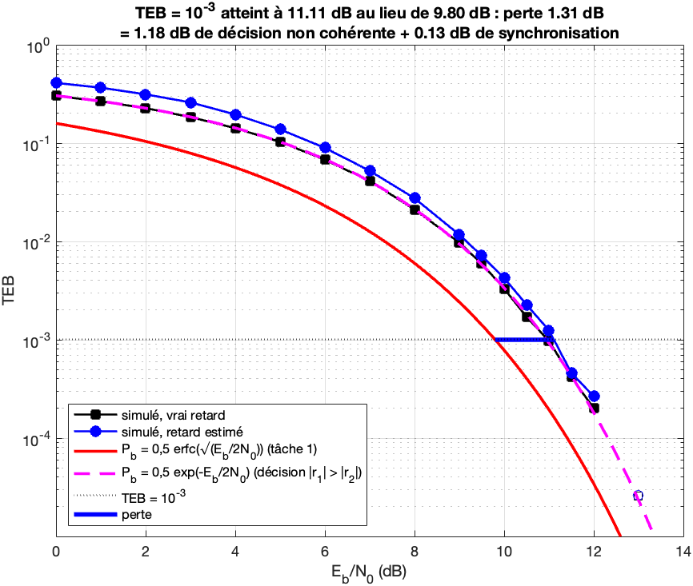

# ADS-B decoder: aircraft messages from raw radio recordings

Airliners broadcast their identity, position, altitude and speed in the clear, on 1090 MHz. This is ADS-B. This repository recovers those messages from raw recordings of a software-defined radio: it finds the frames in the signal, reads the bits, checks them with the CRC, decodes the fields and places the aircraft on a map. The chain is written in MATLAB, then ported to Python and checked block by block against the MATLAB version.

**Pair project, ENSEIRB-MATMECA, autumn 2025. Completed and ported to Python afterwards by Yanis André.**

The subject is the TS229 digital communications project of ENSEIRB-MATMECA. Its statement, application skeleton, protected reference functions and recordings are public in the course's repository (TS229). They are not redistributed here (see [Get the subject files](#get-the-subject-files)).

## Results

| | |
|---|---|
| Input | 9 recordings of 0.5 s at 4 MHz, so 4.5 s of signal, from the subject repository |
| Valid ADS-B messages (DF 17, good CRC) | 171, of which 163 distinct frames (8 are repeats received in another recording) |
| Aircraft | 26, of which 23 have at least one position |
| Positions | 75 (70 airborne positions of types 9 to 17, plus 5 of type 18 whose accuracy is not guaranteed) |
| Teacher's reference chain | its 93 valid messages are all found, in the same recording, at the same position to within one sample, with the same 112 bits |
| Bit error rate in simulation | 10⁻³ reached at 11.11 dB instead of 9.80 dB for coherent detection: a 1.31 dB loss, of which 1.18 dB comes from the non-coherent decision and 0.13 dB from synchronisation |
| Real time | in replay, each 0.5 s recording is decoded, listed and drawn in about 0.1 to 0.25 s |
| Python port | same 171 messages as MATLAB, at the same positions, with the same bits and fields |

The teacher's chain, supplied as protected `.p` files, returns 152 registers on these recordings, of which 93 are valid: 76 distinct frames plus 17 duplicates (the same frame decoded on two neighbouring samples), and 87 positions, of which 70 are distinct. It only decodes identification and two position types (4, 11 and 12). This chain keeps every DF 17 message whose CRC is good, velocities (type 19), status messages (28, 29, 31) and type 18 positions included, which brings 3 more aircraft (3444C3, 405636 and 398446) for 26 in total, against 23.



*Task 4, MATLAB: bit error rate (TEB in French) of the full chain with an unknown delay, frequency offset and phase, against Eb/N0. Black: true delay. Blue: delay estimated by correlation with the preamble. Red: coherent theory. Dashed: non-coherent theory, which the simulation follows. Labels are in French, like the rest of the course material.*

## How it works

1. **Envelope.** The receiver works on the modulus of the complex baseband signal, which removes the unknown phase and frequency offset.
2. **Frame detection.** Each 112-bit message starts with an 8 µs preamble of four pulses. The normalised correlation between the preamble and the signal is computed over the whole recording at once (`conv` and `movsum`). Candidates are the local maxima above the threshold of 0.75.
3. **Demodulation.** With pulse-position modulation, a bit is 1 when the first half of its slot carries more signal than the second half (r1 > r2).
4. **Integrity.** The last 24 bits are a CRC, checked by polynomial division. Only DF 17 messages with a good CRC are kept, and a frame identical to an overlapping previous one is dropped.
5. **Fields.** Callsign, altitude, position (CPR, decoded locally around the antenna at ENSEIRB-MATMECA) and, in the Python port, velocity.
6. **Aircraft.** Each message updates its aircraft, identified by its 24-bit ICAO address, and the map is redrawn after each recording.

**Threshold.** The value 0.75 is supplied with the subject and was not tuned here. The theory shows it is well placed. A clean frame gives a correlation of 1 when aligned and √3/2 ≈ 0.87 at the worst sampling instant, while a window taken inside the data of a frame gives at most 1/√2 ≈ 0.71 and a window one bit too early gives 0.5. `task8_seuil.m` checks it afterwards: 0.70 and 0.75 give the same 171 messages, only the number of candidates changes (8,371 against 1,729).

**False messages.** A random 112-bit word passes the CRC with probability 2⁻²⁴. With 1,729 candidates, about 10⁻⁴ false message is expected over the 9 recordings. A real frame needs at least 6 wrong bits to pass as another valid frame.

**Time covered by the recordings.** The recordings carry no timestamp and are not consecutive. The aircraft move 20 to 27 km between the first and the last one. From the announced velocities (47 segments over 14 aircraft, least squares), the recordings are 10 to 16 s apart, so about 1 min 38 s to 1 min 54 s from the first to the last. This is an estimate, not a measurement.

**Aircraft seen once.** Four aircraft appear in a single message: 39D702, 471F7D, 405636 and 398446. The message of 398446 is a velocity message whose fields all say "information unavailable". The one of 405636 is a velocity message (351 kt, heading 168°, descending at 1,536 ft/min), corroborated by a position read just below the threshold (correlation 0.623, good CRC) at 22,825 ft. They are kept but not relied upon.

## Repository layout

```
src/              MATLAB chain
  PHY/            PPM modulation and demodulation, preamble, CRC, synchronisation, Welch PSD
  MAC/            bit2registre (112 bits to a register), CPR position decoding
  General/        process_buffer (detection and decoding of a whole recording), aircraft list, label layout
  Client/         get_buffer_rejeu: replays the recordings in place of the school's radio
  Tests/          one script per task, checks against the teacher's reference, export for Python
  adsb_app.m      the application, on the live radio or in replay
python/           Python port (NumPy, SciPy), one module per MATLAB block, pytest suite
docs/figures/     figures written by the MATLAB task scripts
```

Code comments, identifiers and figure labels are in French, the language of the course.

## Run the Python port

Requires [uv](https://docs.astral.sh/uv/). Without any data:

```bash
cd python
uv sync
uv run pytest
```

22 tests pass and 13 are skipped with a message saying which file is missing. The tests that run compare each block (PPM, CRC, CPR, synchronisation, PSD) with vectors exported from MATLAB on random inputs, and recompute the bit error rates of tasks 1 and 4 (about 20 s).

With the recordings in `data/` (see below), the port decodes them and prints a summary:

```bash
cd python
uv run python -m adsb.etude
uv run pytest
```

Only the 5 tests that compare with MATLAB outputs computed on the subject's data are still skipped. They need the MATLAB export described in [Run the MATLAB chain](#run-the-matlab-chain). Once it is done, `ADSB_EXIGER_DONNEES=1 uv run pytest` turns every missing file into a failure and runs all 35 tests.

## Get the subject files

The MATLAB chain needs the subject's skeleton (aircraft class, map, radio client) and its protected reference functions for the checks, and both chains need the recordings. From the root of this repository:

```bash
# clone the TS229 course repository into ../TS229
rsync -a --ignore-existing --exclude 'Tests/' ../TS229/src/ src/
mkdir -p data
cp ../TS229/data/adsb_msgs.mat ../TS229/data/buffers.mat data/
```

`rsync --ignore-existing` only adds the files missing here and never overwrites the students' code. Everything fetched this way is listed in `.gitignore`, so it cannot be committed by mistake.

## Run the MATLAB chain

Tested with MATLAB R2024b. From the root of the repository:

```bash
matlab -batch "run('src/Tests/main_tests.m')"
```

It runs 16 checks in about 90 s and stops at the first failure: each block against the teacher's reference on fixed and noisy inputs, the scripts of tasks 1, 2, 3, 4 and 6 (they write the figures in `docs/figures/`), the decoding of the 9 recordings compared message by message with the teacher's chain, and the replay. The chain itself calls no protected function: `sans_fonctions_p.m` replaces each `.p` file with a trap that raises an error, and the whole replay runs under these traps.

To watch the replay, in the MATLAB desktop, from the root of the repository:

```matlab
addpath('src')
adsb_app('rejeu')
```

To export the reference vectors of the Python tests (about 70 s), then run every Python test:

```bash
matlab -batch "addpath('src/PHY','src/MAC','src/General','src/Tests'), exporter_python"
cd python
ADSB_EXIGER_DONNEES=1 uv run pytest
```

## Scope

Tasks 1 (PPM chain), 2 (power spectral density), 3 (CRC), 4 (time synchronisation), 6 (MAC layer), 8 (real recordings) and 9 (real-time application, in replay) are done. The optional tasks 5 (frequency synchronisation), 7 (ground position, velocity, global CPR decoding) and 10 to 12 (track ageing, distance, 3D view) are not, except velocity decoding, which the Python port adds.

After the pair project, the following was done:

- **Fixed.** The CRC functions and `cprNL` crashed on some input shapes. `modulatePPM` treated the "no pulse" symbol as a 1, which broke the preamble. The demodulator compared energies and made about twice too many errors in simulation. It now applies the maximum-likelihood rule. The Welch PSD had the wrong scale.
- **Written.** The processing of whole recordings (`process_buffer`, `update_liste_avion`), the replay, the checks against the teacher's reference and the analysis of the threshold.
- **Ported.** The Python chain, with the bit error rates computed again and the estimate of the time covered by the recordings.

## Limits

- **No live reception.** The school's radio server is only reachable from the campus network, so task 9 runs on the recordings. Everything comes from 4.5 s of recorded signal.
- **No external check.** The positions were not compared with a flight-tracking site, since the recordings have no date.
- **Estimated duration.** The time between recordings is inferred from the aircraft velocities.
- **Simulated noise.** The bit error rate curves use additive white Gaussian noise, not the radio's real noise.
- **Dependence on the subject.** The MATLAB checks need the teacher's protected functions, fetched from the subject repository.

## Credits

- Pair project, ENSEIRB-MATMECA, autumn 2025. Completed and ported to Python afterwards by Yanis André.
- Subject, recordings, application skeleton and protected reference functions: TS229 course, ENSEIRB-MATMECA, the course's public repository (TS229). `adsb_app.m` is adapted from the skeleton. The PHY and MAC functions, `process_buffer.m` and `update_liste_avion.m` keep the signatures given by the subject, with bodies written by the students. The files supplied by the subject and left unchanged are not included.
- ADS-B messages are broadcast in the clear by aircraft.

Contact: contact@yanis-andre.fr

## Licence

No licence yet, see [LICENSE-PENDING.md](LICENSE-PENDING.md).
